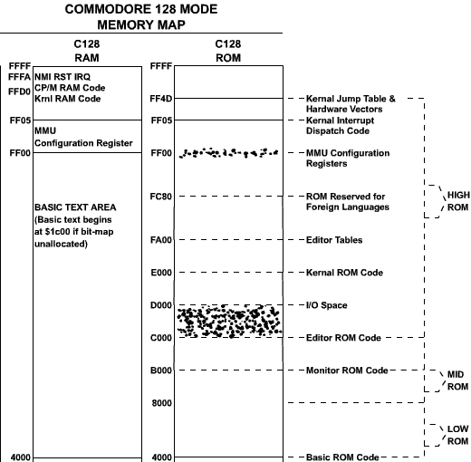

Monitor COMMODORE 128
=====================

Instrucciones Monitor Commodore
-------------------------------

- `G` GO RUN
- `L` LOAD FROM TAPE OR DISK
- `M` MEMORY DISPLAY
- `R` REGISTER DISPLAY
- `S` SAVE TO TAPE OR DISK
- `X` EXIT TO BASIC
- `A` SIMPLE ASSEMBLER
- `D` DISASSEMBLER
- `F` FILL MEMORY
- `H` HUNT MEMORY
- `P` PRINTING DISASSEMBLER
- `T` TRANSFER MEMORY

Uso del Monitor
---------------
Iniciar el emulador de commodore 128 seleccionando *Aplicaciones -> Otras -> Commodore 128*.

Para ingresar al monitor ejecutar el comando:
```
MONITOR
```
ó
```
SYS 1024
```


### R - Muestra los registros de la CPU

Ejecutar:
```
R
```

Donde:
    
    PC: Program Counter
    IRQ: Interrupt vector
    AC: Content of ACcumulator
    XR: Content of X-index Register
    YR: Content of Y-index Register
    SP: Content of Stack Pointer

### M - Muestra un mapa de memoria

Sin dirección inicial, nos muestra las direcciones 00000 a 000B0)

Para ver a partir de una dirección específica, se la pasa como parámetro:
```
M 00000
```



### F - Llena un rango de direcciones con un valor

```
F 00040 0004F FF
```

Vemos el cambio efectuado
```
M 00000
```

Ahora llenemos otro rango de direcciones:
```
F 00090 0009F FF
```

UPS !!!

Reiniciar.

Tipear `NEW`

Crear el siguiente programa
```basic
10 PRINT "HOLA MONITOR!"
20 END
```

`RUN`

Ingresar nuevamente al monitor
```
MONITOR
```

Vemos el área de texto de los programas
```
M $1C00 
```

### H - Busca en un rango de direcciones una cadena ASCII o Hexa


H 00000 00FFF 'HOLA

M 00200

### G - Ejecuta el código a partir del valor almacenado en el PC

`G XXXX` Ejecuta el código a partir de la dirección XXXH

`F 01000 01100 FF`

`G 01000`


@ - Muestra el estado del floppy


Referencias
-----------

* https://www.c64-wiki.com/wiki/TEDMON 