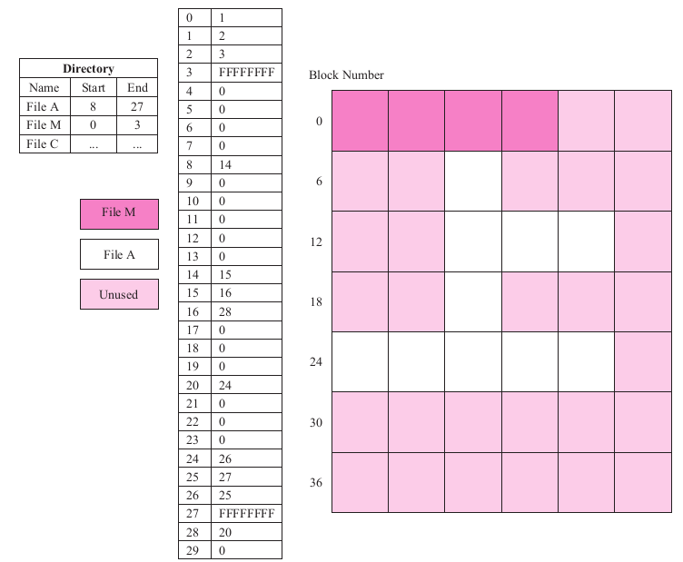
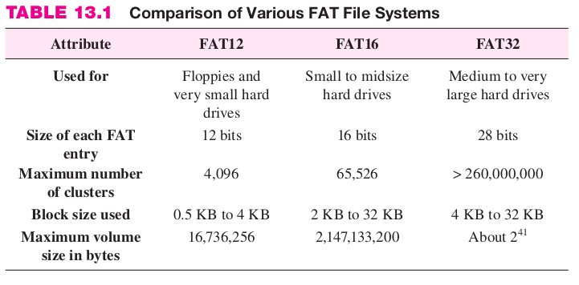
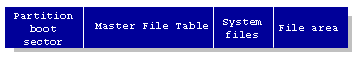
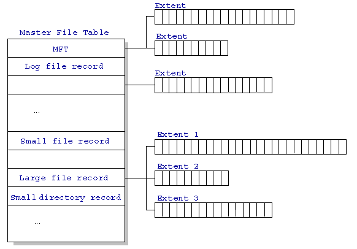
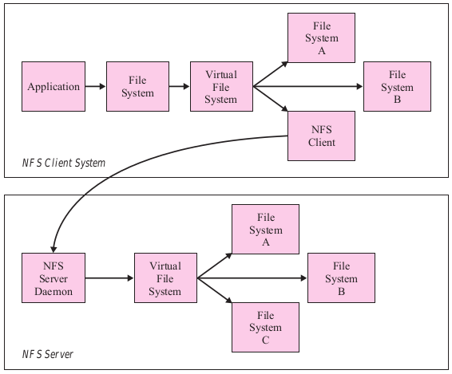
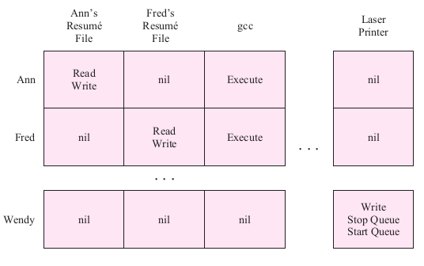
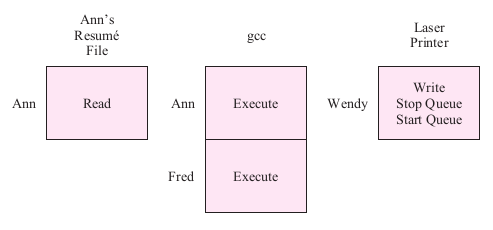
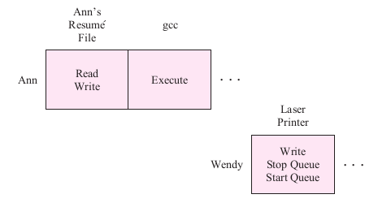

<!-- Comentarios para reveal.js -->
<!-- Dos lineas vacías separan dos slides horizontalmente -->
<!-- Tres líneas vacías separan dos slides horizontalmente -->
# Unidad 4
## S.O. Multitarea Multiusuario

  
https://sofrcu.github.io/slides/2024/09/
<!-- .element: style="border-width:0; height: 6em;" -->

# Repaso: FAT

  <!-- .element: style="border-width:0; height: 8em;" -->
Ejemplo de una tabla FAT

# Repaso: FAT

  <!-- .element: style="border-width:0; height: 8em;" -->
Distintas versiones de FAT

# NTFS

* Sistema de archivos nativo en Windows NT. <!-- .element: class="fragment fade-in" -->
* Usa una MFT para los metadatos. <!-- .element: class="fragment fade-in" -->
* A cada archivo y directorio se le asocia un registro en la MFT. <!-- .element: class="fragment fade-in" -->
* A cada registro se le asocian atributos. <!-- .element: class="fragment fade-in" -->
* Los atributos pueden ser metadatos o incluso el contenido del archivo. <!-- .element: class="fragment fade-in" -->

# NTFS (2)

* Usa bitmaps para rastrear el espacio libre y un mapa separado para los sectores defectuosos. <!-- .element: class="fragment fade-in" -->
* Soporta bloques de tamaño variable, compresión y encriptación <!-- .element: class="fragment fade-in" -->
* Soporta RAID 1 y RAID 5. <!-- .element: class="fragment fade-in" -->
* Es transaccional (log-based) <!-- .element: class="fragment fade-in" -->

# Estructura NTFS

  <!-- .element: style="border-width:0; height: 4em;" -->
Estructura de un volúmen NTFS

# Estructura MFT

  <!-- .element: style="border-width:0; height: 8em;" -->
Estructura de de la Master File Table

# Estructura MFT

  <!-- .element: style="border-width:0; height: 4em;" -->
Registro MFT de un archivo pequeño

# Atributos NTFS

| Tipo | Descripción |
| ---- | ----------- |
| Standard Information | timestamps y enlaces | 
| Attribute List | Punteros a los atributos externos | 
| File Name | Nombres(s) del archivo | 
| Security Descriptor | Dueño y privilegios | 
| Data | Datos (contenido) del archivo | 
| Object ID | Identificador único dentro del volúmen | 
<!-- .element: style="font-size: 0.6em;" -->

# Atributos NTFS (2)

| Tipo | Descripción |
| ---- | ----------- |
| Logged Utility Stream | Log de operaciones. |
| Reparse Point | Usado en los puntos de montaje. |
| Index Root | Índice raíz para directorios y otros índices. |
| Index Allocation | Usado en directorios y otros índices. |
| Bitmap | Usado en directorios y otros índices. |
| Volume Information | Versión del volúmen. |
| Volume Name |	Nombre del volúmen |
<!-- .element: style="font-size: 0.6em;" -->

# UNIX y Linux

* Soportan diferentes sistemas de archivos. <!-- .element: class="fragment fade-in" -->
* La mayoría basados en el sistema "ext". <!-- .element: class="fragment fade-in" -->
* Los metadatos se almacenan en una estructura llamada i-nodo. <!-- .element: class="fragment fade-in" -->
* El nombre del archivo se almacena en la entrada de directorio. <!-- .element: class="fragment fade-in" -->

# Estructura de EXT

  <!-- .element: style="border-width:0; height: 6em;" -->
Estructura de un FS EXT

# Estructura de EXT

  <!-- .element: style="border-width:0; height: 8em;" -->
Estructura de un i-nodo.

# Estructura de EXT

  <!-- .element: style="border-width:0; height: 8em;" -->
Estructura de directorio EXT

# Montaje de FS

  <!-- .element: style="border-width:0; height: 8em;" -->
Un sistema de archivos montado en UNIX.

# Montaje de FS

  <!-- .element: style="border-width:0; height: 8em;" -->
Un sistema de archivos remoto en UNIX.

# Seguridad

Amenazas:<!-- .element: class="fragment fade-in" -->

* Virus, troyanos y gusanos.<!-- .element: class="fragment fade-in" -->
* Spyware.<!-- .element: class="fragment fade-in" -->
* Ataques DoS y DDoS.<!-- .element: class="fragment fade-in" -->
* Desbordamientos (buffer, stack, heap).<!-- .element: class="fragment fade-in" -->
* Scripts y applets.<!-- .element: class="fragment fade-in" -->

# Protección

 

Autenticación <!-- .element: class="fragment fade-in" -->

Autorización <!-- .element: class="fragment fade-in" -->

Control de Acceso<!-- .element: class="fragment fade-in" -->

# Matriz de Acceso

  <!-- .element: style="border-width:0; height: 8em;" -->
Matriz de Control de Acceso.

# ACL

  <!-- .element: style="border-width:0; height: 8em;" -->
Lista de Control de Acceso (ACL).

# Capability List

  <!-- .element: style="border-width:0; height: 8em;" -->
Lista de Capacidades.

# Políticas

 

Contingencias (backups).<!-- .element: class="fragment fade-in" -->

Protecciones de concurrencia. <!-- .element: class="fragment fade-in" -->

Protecciones de Archivos.<!-- .element: class="fragment fade-in" -->

# Bibliografía

 

**Elmasri** - Capítulo 13.

**Elmasri** - Capítulo 16.

# Gracias!

[https://sofrcu.github.io/](https://sofrcu.github.io/)

   <!-- .element: style="border-width:0; height: 1.5em;" -->
Esta obra de [Gabriel Arellano](https://github.com/aretche/) está bajo una licencia [Creative Commons Atribución-CompartirIgual 4.0 Internacional](https://creativecommons.org/licenses/by-sa/4.0/deed.es). 
https://github.com/aretche/
