<!-- Comentarios para reveal.js -->
<!-- Dos lineas vacías separan dos slides horizontalmente -->
<!-- Tres líneas vacías separan dos slides horizontalmente -->
# Unidad 5
## S.O. de Tiempo Real

  
https://sofrcu.github.io/slides/2024/12/
<!-- .element: style="border-width:0; height: 6em;" -->

# Tiempo Real

 

* Resultados en un marco temporal específico. <!-- .element: class="fragment fade-in" -->
* Tiempo real estricto. <!-- .element: class="fragment fade-in" -->
* Tiempo real no estricto. <!-- .element: class="fragment fade-in" -->
* Suelen usar sistemas integrados / embebidos. <!-- .element: class="fragment fade-in" -->

# Características

 

* Tienen un único propósito. <!-- .element: class="fragment fade-in" -->
* Son de pequeño tamaño. <!-- .element: class="fragment fade-in" -->
* Son de bajo costo y frabricados en masa. <!-- .element: class="fragment fade-in" -->
* Tienen requisitos de temporización específicos. <!-- .element: class="fragment fade-in" -->

# Sistemas On Chip

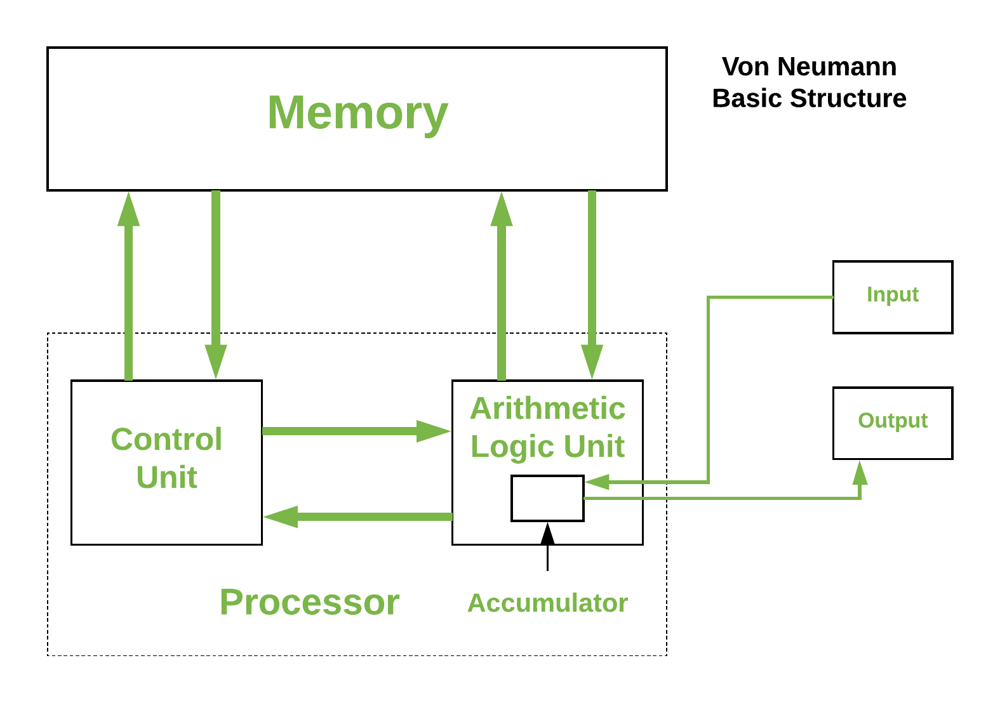 <!-- .element: style="border-width:0; float: left; height: 7em;" -->
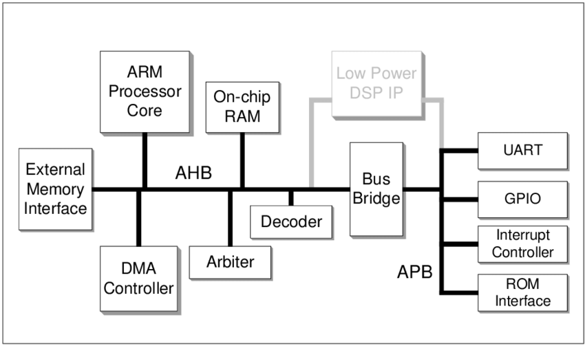  <!-- .element: style="border-width:0; float: rigth; height: 7em;" -->
Arquitecturas Von Neumann vs SoC.

# Sistemas On Chip

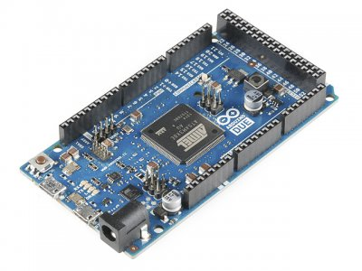 <!-- .element: style="border-width:0; float: left; height: 7em;" -->
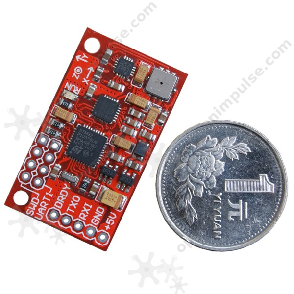  <!-- .element: style="border-width:0; float: rigth; height: 7em;" -->
Dos modelos de Arduino con chips SoC ARM.

# Sistemas On Chip

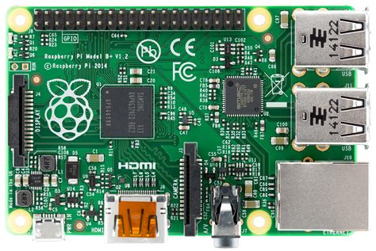 <!-- .element: style="border-width:0; float: left; height: 7em;" -->
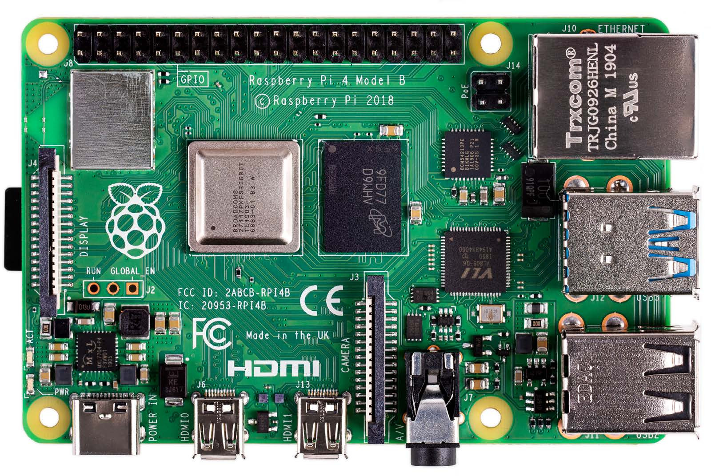  <!-- .element: style="border-width:0; float: rigth; height: 7em;" -->
Dos modelos de Raspberry Pi con chips SoC ARM.

# S.O. Tiempo Real

 

* Planificación apropiativa basada en prioridades. <!-- .element: class="fragment fade-in" -->
* Kernel apropiatvo <!-- .element: class="fragment fade-in" -->
* Latencia minimizada. <!-- .element: class="fragment fade-in" -->

 

# Latencia (cont.)

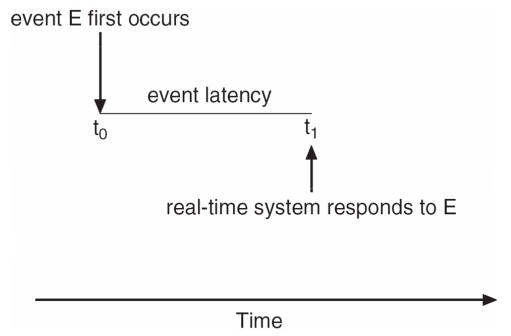  <!-- .element: style="border-width:0; height: 8em;" -->
Latencia de evento o suceso.

# Latencia (cont.)

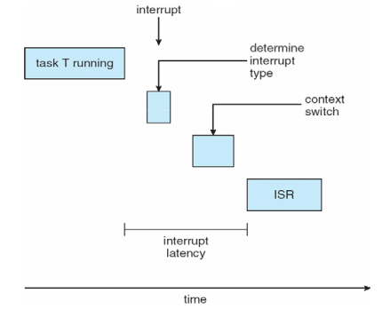 <!-- .element: style="border-width:0; float: left; height: 7em;" -->
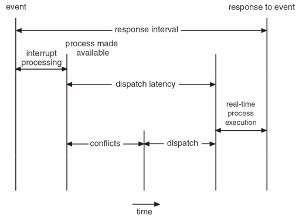  <!-- .element: style="border-width:0; float: rigth; height: 7em;" -->
Latencias de interrupción y despacho.

# Inversión

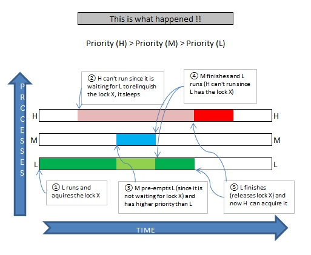  <!-- .element: style="border-width:0; height: 8em;" -->
El problema de Inversión de Prioridades.

# Planificación

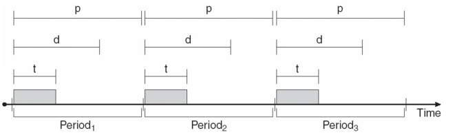  <!-- .element: style="border-width:0; height: 8em;" -->
Los eventos son periódicos.

# Planificación

 

Algoritmos de planificación: <!-- .element: class="fragment fade-in" -->

* Prioridad monótona en tasa. <!-- .element: class="fragment fade-in" -->
* Prioridad en finalización de plazo. <!-- .element: class="fragment fade-in" -->
* Cuota proporcional. <!-- .element: class="fragment fade-in" -->

# Bibliografía

 
 
Silverschatz - Capítulo 19.
 
 

# Gracias!

[https://sofrcu.github.io/](https://sofrcu.github.io/)

   <!-- .element: style="border-width:0; height: 1.5em;" -->
Esta obra de [Gabriel Arellano](https://github.com/aretche/) está bajo una licencia [Creative Commons Atribución-CompartirIgual 4.0 Internacional](https://creativecommons.org/licenses/by-sa/4.0/deed.es). 
https://github.com/aretche/
